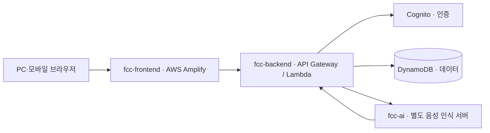

# fcc-frontend · Family Care Cloud

가족이 함께 돌봄 기록과 일정을 관리하고, 다음 보호자에게 필요한 정보를 전달하는 웹서비스입니다.
이 저장소는 **PC와 모바일 브라우저에서 사용하는 화면과 백엔드 연결**을 담당합니다.

**[서비스 열기](https://develop.db2l4u9y804jp.amplifyapp.com/)**

로그인 없이 화면을 둘러볼 수 있습니다. 가족 그룹을 만들거나 초대 코드로 참여해 실제 데이터를 사용하려면 회원가입과 로그인이 필요합니다.

## 팀 구성

총 5명이 함께 개발합니다.

| 역할 | 인원 | 담당 |
|---|---:|---|
| 팀장 · 프론트엔드 | 1명 | 프로젝트 진행 조율, PC·모바일 화면, 백엔드 API 연결 |
| 백엔드 | 1명 | 인증, 가족 그룹, 기록·일정 관리, 데이터 저장 |
| AI 중심 개발 | 1명 | 음성 인식 모델과 AI 서버, 백엔드 연동 협업 |
| 사용자 경험 기획 | 1명 | 화면 구성, 이동 흐름, 사용 편의성 |
| 기능 기획 | 1명 | 기능 요구사항, 동작 규칙, 예외 상황 |

## 주요 기능

아래는 프론트 화면과 API 연결이 구현된 기능입니다. 모든 기능의 실제 사용자 검증이 끝났다는 의미는 아닙니다.

| 기능 | 내용 |
|---|---|
| 둘러보기 | 로그인 전 서비스 화면 탐색, 그룹 생성·참여 시 인증 안내 |
| 회원가입·로그인 | 이메일 인증, 인증코드 재전송, 미인증 계정의 인증 이어하기, 비밀번호 표시 전환 |
| 홈 | 가족의 일정과 돌봄 현황 확인, 주요 화면으로 이동 |
| 일정 | 오늘·주간·월간 보기, 등록·수정·삭제, 완료·취소 및 상태 필터 |
| 돌봄 기록 | 기간별 조회, 등록·수정·삭제, 기록 유형 선택 또는 서버 자동 분류 요청 |
| 브리핑·인수인계 | 기록을 바탕으로 요약 생성·조회, 근거 확인, 인수인계 확인 처리 |
| 가족 | 그룹 생성·참여, 초대 코드 생성, 돌봄 대상자 정보 관리, 담당 보호자 교대 |
| AI 비서 | 텍스트·음성 질문을 백엔드에 전달하고 답변 표시 |
| 내 프로필 | 이름 변경, 계정 정보 확인, 로그아웃 |

회원가입 비밀번호는 **공백 없이 8~128자, 특수문자 1개 이상**입니다. 인증코드 재전송은 서버에서 제공하는 대기시간과 제한을 따릅니다.
가족 초대 코드는 사용자가 직접 전달하며, 초대 이메일을 자동으로 보내지는 않습니다.

## 기술 스택

| 분류 | 기술 |
|---|---|
| 화면 개발 | React 19, TypeScript |
| 개발 서버·빌드 | Vite 8 |
| 스타일 | CSS, PC·모바일 반응형 레이아웃 |
| API 통신 | Fetch API, 백엔드 인증 토큰 |
| 음성 입력 | MediaRecorder, Web Audio API, WAV 변환 |
| 코드 검사 | TypeScript, Oxlint |
| 배포 | AWS Amplify Hosting, GitHub `develop` 연동 |

## 시스템 구조



- 프론트는 백엔드 API를 통해 인증과 데이터 저장을 요청합니다.
- 음성 질문은 브라우저에서 녹음해 WAV로 변환한 뒤 백엔드에 보냅니다. 백엔드가 AI 서버에 음성 인식을 요청하고, 인식된 문장으로 답변을 구성합니다.
- 기록 분류·인수인계 요약은 백엔드가 처리합니다. Bedrock 사용 여부는 백엔드 배포 설정에 따라 결정되며, 프론트 화면만으로 활성화를 의미하지 않습니다.
- 현재 AI 비서의 질문 처리는 DB와 키워드·날짜 해석을 기반으로 합니다. 범용 생성형 챗봇과는 동작 범위가 다릅니다.

## 로컬 실행

Node.js 22 이상과 npm을 준비한 뒤 실행합니다.

```bash
git clone https://github.com/FamilyCareCloud/fcc-frontend.git
cd fcc-frontend
git switch develop
npm ci
npm run dev
```

터미널에 표시되는 주소를 브라우저에서 엽니다. 기본 포트는 `5173`이며, 사용 중이면 다른 포트가 표시될 수 있습니다.

**기본 설정은 배포된 실제 백엔드에 연결됩니다.** 등록한 기록과 일정도 실제 서버에 저장되므로 테스트용 가족 그룹을 사용해 주세요.

### 환경 변수

다른 백엔드에 연결하려면 `.env.example`을 복사해 `.env.local`을 만들고 수정합니다. 변경 후에는 개발 서버를 재시작합니다.

| 변수 | 용도 |
|---|---|
| `VITE_API_BASE_URL` | 프론트에서 직접 호출할 API 주소. 로컬 개발에서는 비워 두면 Vite 프록시 사용 |
| `VITE_DEV_PROXY_TARGET` | 로컬 Vite 프록시가 연결할 백엔드 주소. 기본값은 배포된 FCC API |

로컬에서는 프록시를 사용하는 것이 기본입니다. `VITE_API_BASE_URL`로 서버에 직접 연결하면 백엔드의 CORS 허용 주소도 맞아야 합니다.
`VITE_` 변수는 브라우저에 공개되므로 AWS 비밀키, AI 서버 API 키, 비밀번호를 넣지 않습니다.

### 코드 검사와 빌드

```bash
npm run lint
npm run build
```

빌드 결과는 `dist/`에 생성됩니다. `npm run preview`로 결과 화면을 볼 수 있지만, 개발 서버의 API 프록시는 적용되지 않습니다. API까지 사용하려면 빌드 시 공개 API 주소와 백엔드 CORS 설정을 맞춰야 합니다.

## 코드 구조

```text
fcc-frontend/
├── src/                 # 화면, 스타일, API 연결
├── docs/                # 프로젝트 문서
├── .env.example         # 환경 변수 예시
├── amplify.yml          # Amplify 설치·검사·빌드 설정
├── vite.config.ts       # 개발 서버와 API 프록시
├── package.json         # 의존성과 실행 명령
└── README.md
```

| 파일 | 역할 |
|---|---|
| `src/RealApp.tsx` | 로그인 상태, 가족 그룹 선택, 주요 화면 전환 |
| `src/GuestApp.tsx` | 로그인 전 둘러보기 |
| `src/RealAuth.tsx`, `src/PasswordInput.tsx` | 가입·로그인·이메일 인증, 비밀번호 입력 |
| `src/api.ts` | 백엔드 요청, 오류 처리, 세션 관리 |
| `src/Dashboard.tsx`, `src/Shell.tsx` | 홈 화면, 공통 메뉴와 레이아웃 |
| `src/RealSchedules.tsx`, `src/ScheduleCalendar.tsx` | 일정 관리와 달력 |
| `src/RealRecords.tsx`, `src/RealHandoff.tsx` | 돌봄 기록과 인수인계 |
| `src/RealFamily.tsx`, `src/RealGroupSetup.tsx` | 가족 그룹과 보호자 관리 |
| `src/RealAssistant.tsx`, `src/voice.ts` | AI 질문 화면과 음성 녹음·변환 |
| `src/RealProfile.tsx`, `src/UxDetails.tsx` | 프로필과 홈 세부 화면 |
| `src/ViewportFit.tsx`, `src/*.css` | 화면 크기 대응과 스타일 |

## 배포와 협업

- 작업 브랜치에서 수정한 뒤 PR로 `develop`에 병합합니다.
- `develop` 변경 시 AWS Amplify가 자동으로 프론트를 배포합니다.
- `amplify.yml`에서 의존성 설치 → 린트 → 빌드를 실행하고 `dist/`를 게시합니다.
- API 주소는 Amplify의 `VITE_API_BASE_URL`로 지정할 수 있으며, 미설정 시 빌드 설정의 FCC API 주소를 사용합니다.
- 프론트 배포가 백엔드·AI 서버를 함께 배포하지는 않습니다. API 형식이나 인증 정책을 바꾸면 각 저장소의 설정을 함께 맞춥니다.

## 현재 한계와 남은 과제

- **준비 중인 화면:** 사진 첨부, 복약 완료 체크, 건강 수치 저장, 교대 시간·장소, 알림·접근성 설정, 추가 프로필 정보, 비밀번호 변경, 회원 탈퇴는 비활성 UI로 표시됩니다. 유료 그룹과 결제는 현재 범위에 포함하지 않습니다.
- **음성 기능:** 브라우저의 마이크 권한과 HTTPS 또는 localhost 환경이 필요합니다. 별도 AI 서버나 연결 주소가 중단되면 음성 인식도 사용할 수 없습니다.
- **AI 요약:** API 연결과 실제 모델 사용은 별개입니다.
- **사용자 검증:** 인증 개선의 자동 검사와 배포는 완료됐지만, 실제 이메일 수신·인증 테스트와 다양한 기기·다중 사용자 환경 검증은 별도로 진행합니다.
- **화면·세션:** 화면 크기에 맞춰 주요 기능을 배치하지만 콘텐츠 양에 따라 스크롤이 필요할 수 있습니다. 로그인 정보는 현재 브라우저의 localStorage에 저장합니다.

## 관련 저장소

- [fcc-frontend · 웹 화면](https://github.com/FamilyCareCloud/fcc-frontend)
- [fcc-backend · 인증·데이터·API](https://github.com/FamilyCareCloud/fcc-backend)
- [fcc-ai · 음성 인식 서버](https://github.com/FamilyCareCloud/fcc-ai)
